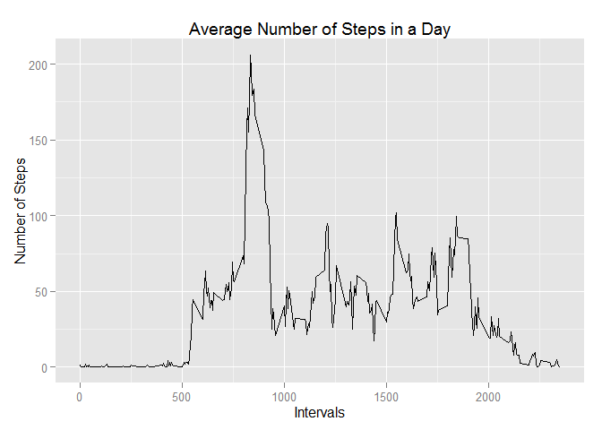

# Reproducible Research: Peer Assessment 1

Compiled and written by Nicholas Ng on 18 Jan 2015.

As part of the peer assessment 1 for the Reproducible Research course, the following knitted Rmarkdown details the code and results of the code which was used to answer the questions in the assessment.

## Loading and preprocessing the data

Loading the dplyr and lubridate packages for processing data (messages are suppresed so as not to clog up the html document):

```r
suppressMessages(library(dplyr))
suppressMessages(library(lubridate))
```

Reading the data from the given csv file into R, and transforming the date rows
into a date format:

```r
dataset <- tbl_df(read.csv("activity.csv"))

dataset$date <- ymd(dataset$date)
```


## What is mean total number of steps taken per day?
In this section, the "total number of steps taken per day" has been interpreted to mean that the number of steps per interval throughout each day in the data set should be summed up to produce a total number per day. All subsequent graphs and statistics are computed based on this evaluated data set.

Loading the ggplot2 package for plotting graphs:

```r
suppressMessages(library(ggplot2))
```

Extracting a subset from the dataset that does not contain NA values:

```r
steps_set <- dataset[complete.cases(dataset), ]
```

Computing the total number of steps per day via dplyr grouping and summary:

```r
steps_summary <- steps_set %>%
                    group_by(date) %>%
                    summarise(steps = sum(steps))
```

Plotting a histogram of total steps taken per day:

```r
steps_plot <- ggplot(steps_summary, aes(x = steps)) +
                geom_histogram() +
                scale_y_discrete() +
                labs(title = "Histogram of Total Number of Steps Taken per Day", 
                     x = "Number of Steps", y = "Number of Days")
suppressMessages(print(steps_plot))
```

 

To calculate the mean and median total number of steps taken per day, the following lines of code are run:

```r
steps_mean <- mean(steps_summary$steps)
steps_median <- median(steps_summary$steps)
```
This therefore gives us a mean total number of steps taken per day of approximately 10,766 and a median of 10,765.

## What is the average daily activity pattern?
To create the plot to answer the questions in this section, the data set first needs to be transformed by averaging the number of steps taken for each interval across all days. Subsequently, the plot and computation will be based on this transformed data set.

The following lines of code use the summary function in dplyr to average the number of steps taken.

```r
avg_summary <- dataset %>%
                group_by(interval) %>%
                summarise(steps = mean(steps, na.rm = T))
```

The required plot is created based on the following ggplot2 functions:

```r
avg_plot <- ggplot(avg_summary, aes(x = interval, y = steps)) +
            geom_line() +
            labs(title = "Average Number of Steps in a Day", 
                     x = "Intervals", y = "Number of Steps")
print(avg_plot)
```

 

It is clear from the plot above that there is a particular interval which contains the maximum average number of steps. Hence, the following code searches for that interval:

```r
max_interval <- subset(avg_summary, steps == max(steps))[[1]]
```
The interval that has the maximum average number of steps is therefore interval 835.

## Imputing missing values
Since R cannot make logical comparisons to NA values, the number of missing values can be computed as the difference between the number of rows between a cleaned data set, and the original data set. Since a cleaned data set has been previously made, the following code will give the count of the number of missing values:

```r
missing_count <- nrow(dataset) - nrow(steps_set)
```
The number of missing values in the original data set is 2,304.

There are a number of possible strategies involved in imputing missing values in the data set:  
1. As suggested in the assessment instructions, the missing values could be replaced by the simple mean/median for the day. However, this may not be taking the possibility of different activities at different times of the day.  
2. We could use the sample mean of that particular interval across all days in the data set. This would ensure that time-specific factors are taken into consideration: a person does not take that many steps during sleeping or eating hours, etc.  
3. To take the above strategy one step further, one can use the mean number of steps for that interval only from the day of the week which the missing value belongs to (e.g. to extract the mean only from interval 1000 of Mondays). This would assume that the person to which this fitness tracker belongs to has a fixed weekly schedule.

Since strategy 3 is the most interesting (though not necessarily the right one), we shall proceed with that. To be able to compute the mean of intervals per day of the week, we will have to mutate a new column in the original data set and summarise by computing the mean by interval and weekday:

```r
wkday_set <- mutate(dataset, wkday = wday(date, label = T, abbr = T))

wkday_summary <- wkday_set %>%
                group_by(wkday, interval) %>%
                summarise(steps = mean(steps, na.rm = T))
```

Now, to impute the missing values, the following code is run, which evaluates each row in the original `wkday_set` and replaces missing values based on the interval and weekday of that element. A copy of the original data is made beforehand for comparison purposes later (just in case). To ensure that there are no remaining missing values, a summary of the cleaned data set is also made:

```r
wkday_set <- mutate(wkday_set, clean_steps = steps)

for (i in 1:nrow(wkday_set)) {
    if (is.na(wkday_set$steps[i])) {
        wkday_set$clean_steps[i] <- filter(wkday_summary, 
                                     wkday == wkday_set$wkday[i],
                                     interval == wkday_set$interval[i])[[3]]
    }
}

summary(select(wkday_set, steps, clean_steps))
```

```
##      steps         clean_steps    
##  Min.   :  0.00   Min.   :  0.00  
##  1st Qu.:  0.00   1st Qu.:  0.00  
##  Median :  0.00   Median :  0.00  
##  Mean   : 37.38   Mean   : 37.57  
##  3rd Qu.: 12.00   3rd Qu.: 19.04  
##  Max.   :806.00   Max.   :806.00  
##  NA's   :2304
```
As seen in the summary table able, there are no longer any NA values included in the `clean_steps` column.

To identify the effects of imputation, the same code as used in the earlier 2 sections is used to generate plots and calculate the required figures. The `scales` package is loaded to display some of our results in percentages:

```r
library(scales)

wkday_totals <- wkday_set %>%
                    group_by(date) %>%
                    summarise(clean_steps = sum(clean_steps))

totals_plot <- ggplot(wkday_totals, aes(x = clean_steps)) +
                geom_histogram() +
                scale_y_discrete() +
                labs(title = "Histogram of Total Number of Steps Taken per Day (Cleaned)", 
                     x = "Number of Steps", y = "Number of Days")
suppressMessages(print(steps_plot))
```

 

```r
total_mean <- mean(wkday_totals$clean_steps)
total_median <- median(wkday_totals$clean_steps)

var_mean <- percent((total_mean / steps_mean - 1))
var_median <- percent((total_median / steps_median - 1))
```
We could compare the 2 plots (the above as well as the original total steps plot from before) and try to visually identify differences, however it would be easier to refer to the relative difference between the new mean and median versus the previous figures:  
- The new mean and median are 10,821 and 11,015 respectively.  
- The relative difference between the new mean and median, and the old ones are 0.511% and 2.32% respectively.

A possible reason why the relative differences may be this small could be that the missing values were recorded at intervals of the day where little movement is typically recorded across days for the same interval.

## Are there differences in activity patterns between weekdays and weekends?
To evaluate the differences in activity patterns between weekdays and weekends, we would need to mutate another variable as an indicator of whether the date in the data set refers to a weekday or weekend. For this, we shall make use of the cleaned data set as instructed, which has the added benefit of having weekdays already included as a variable:

```r
day_type <- as.numeric(wkday_set$wkday)

for (i in 1:length(day_type)) {
    if (day_type[i] == 1 | day_type[i] == 7) {
        day_type[i] <- 2
    } else {
        day_type[i] <- 1
    }
}

day_type <- factor(day_type, labels = c("Weekday", "Weekend"))
wkday_set <- cbind(wkday_set, day_type)
```

To plot the average across weekdays and weekends the data first needs to be transformed such that the number of steps per interval is averaged across weekdays and weekend groups first:

```r
day_summary <- wkday_set %>%
                group_by(day_type, interval) %>%
                summarise(clean_steps = mean(clean_steps))
```

Once the data transformed, we can proceed to plot the required graphs:

```r
day_plot <- ggplot(day_summary, aes(x = interval, y = clean_steps)) +
            facet_grid(day_type ~ .) +
            geom_line() +
            labs(title = "Average Number of Steps in a Weekday/Weekend", 
                     x = "Intervals", y = "Number of Steps")
print(day_plot)
```

 
